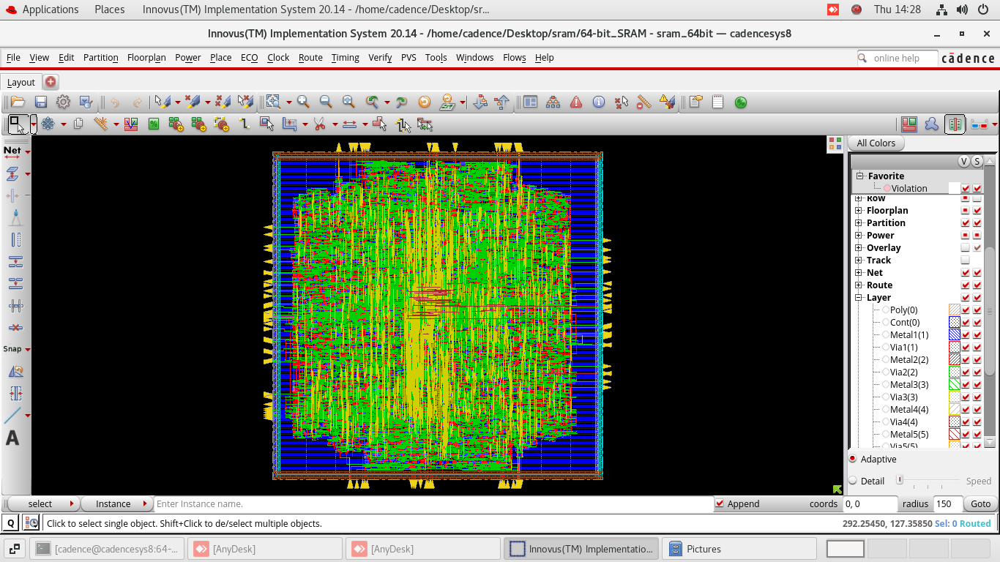

# Designing a 64x64 Bit 0.5KB RAM Using Cadence Genus and Innovus

This project provides a comprehensive understanding of both the synthesis and physical design processes involved in memory design. 🚀

## Project Overview
The aim was to design a 64x64 bit RAM, a fundamental component in many digital systems. This 0.5KB memory design encompassed various stages, from coding in Verilog to physical implementation and verification using industry-standard tools.

## Steps Involved

### 🖥️ Verilog Design
- Created a Verilog module for the 64x64 bit RAM, focusing on efficient memory operations.

### 🔧 Synthesis with Genus
- Utilized Cadence Genus to synthesize the Verilog code into a gate-level netlist.
- Addressed constraints and optimized the design for performance and area.

### 🏗️ Place-and-Route with Innovus
- Imported the synthesized netlist into Cadence Innovus for physical design.
- Performed floorplanning, placement, clock tree synthesis, and routing.
- Ensured the design met all timing, area, and power specifications.

## Highlights
- Overcame challenges related to design constraints and optimization.
- Generated detailed reports for area, gate count, power, and timing.
- Achieved a functional and verified physical layout, ready for fabrication.

## Visuals
Here are some screenshots from the Innovus tool, showcasing the layout and routing of the 64x64 bit RAM.

Feel free to reach out if you have any questions or would like to discuss this project in more detail.

## Tags
hashtag#EDA hashtag#Verilog hashtag#Cadence hashtag#Genus hashtag#Innovus hashtag#DigitalDesign hashtag#VLSI hashtag#Semiconductors
